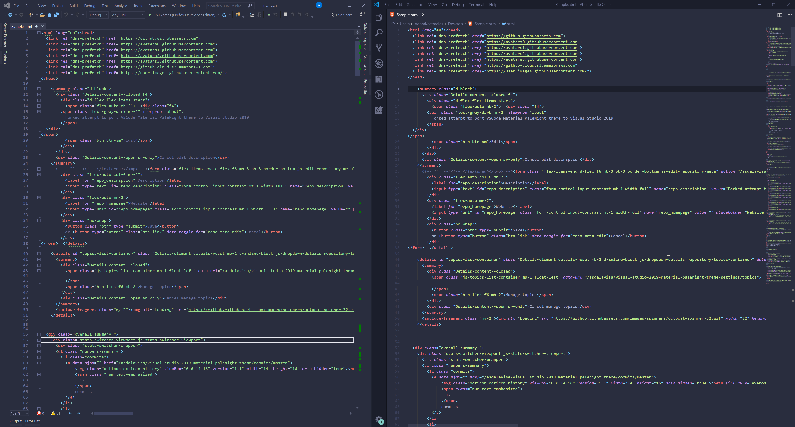

# Visual-Studio-2019-Material-Palenight-theme
Forked attempt to port Material VSCode PaleNight theme to Visual Studio 2019

Based on :
- https://github.com/equinusocio/vsc-material-theme Palenight High Contrast edition.

- Forked from https://github.com/gjactat/visual-studio-2017-palenight-theme which is originally based on the below:
- https://marketplace.visualstudio.com/items?itemName=whizkydee.material-palenight-theme
- https://studiostyl.es/schemes/material-theme-pale-night (editor colors)

Far from pixel perfect... But that will do for me. Feel free to clone this repo and make this theme better !

## Installation

- Install the "Color Theme Editor for Visual Studio" extension
- Import the .pkgdef theme file
- Double click on the imported "Palenight" theme to enable it

That's it !
